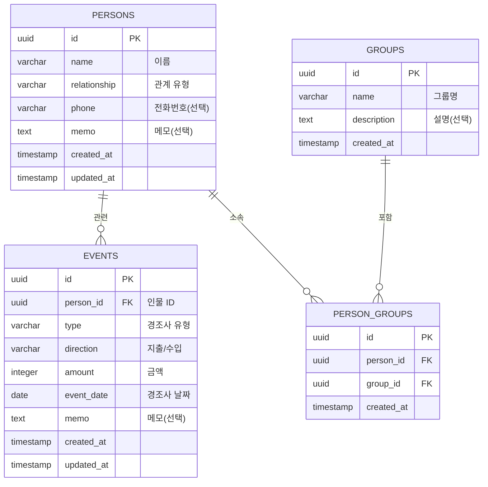

# 💾 데이터 모델 설계서
## 경조사비 관리 앱

---

## 1. ER 다이어그램



---

## 2. 테이블 상세

### 2.1 persons (인물)

| 컬럼명 | 타입 | 제약조건 | 설명 |
|---------|------|----------|------|
| `id` | UUID | PK, DEFAULT uuid_generate_v4() | 고유 식별자 |
| `name` | VARCHAR(100) | NOT NULL | 이름 |
| `relationship` | VARCHAR(50) | NOT NULL | 관계 유형 |
| `phone` | VARCHAR(20) | NULLABLE | 전화번호 |
| `memo` | TEXT | NULLABLE | 메모 |
| `created_at` | TIMESTAMP | NOT NULL, DEFAULT NOW() | 생성일시 |
| `updated_at` | TIMESTAMP | NOT NULL, DEFAULT NOW() | 수정일시 |

**관계 유형 (relationship) 열거값:**
| 코드 | 설명 |
|------|------|
| `FAMILY` | 가족/친척 |
| `FRIEND` | 친구 |
| `COLLEAGUE` | 직장동료 |
| `SCHOOL` | 학교 동기 |
| `NEIGHBOR` | 이웃 |
| `BUSINESS` | 비즈니스 |
| `OTHER` | 기타 |

**인덱스:**
- `idx_persons_name` - name 검색 최적화
- `idx_persons_relationship` - 관계별 필터링

---

### 2.2 events (경조사 내역)

| 컬럼명 | 타입 | 제약조건 | 설명 |
|---------|------|----------|------|
| `id` | UUID | PK, DEFAULT uuid_generate_v4() | 고유 식별자 |
| `person_id` | UUID | FK → persons.id, NOT NULL | 관련 인물 |
| `type` | VARCHAR(50) | NOT NULL | 경조사 유형 |
| `direction` | VARCHAR(10) | NOT NULL, CHECK('SENT','RECEIVED') | 지출/수입 |
| `amount` | INTEGER | NOT NULL, CHECK(> 0) | 금액 (원) |
| `event_date` | DATE | NOT NULL | 경조사 날짜 |
| `memo` | TEXT | NULLABLE | 메모 |
| `created_at` | TIMESTAMP | NOT NULL, DEFAULT NOW() | 생성일시 |
| `updated_at` | TIMESTAMP | NOT NULL, DEFAULT NOW() | 수정일시 |

**경조사 유형 (type) 열거값:**
| 코드 | 설명 | 카테고리 |
|------|------|----------|
| `WEDDING` | 결혼 | 경사 |
| `FUNERAL` | 장례 | 조사 |
| `FIRST_BIRTHDAY` | 돌잔치 | 경사 |
| `BIRTHDAY` | 생일 | 경사 |
| `PROMOTION` | 승진 | 경사 |
| `OPENING` | 개업 | 경사 |
| `HOUSEWARMING` | 집들이 | 경사 |
| `RECOVERY` | 쾌유 | 조사 |
| `GRADUATION` | 졸업/입학 | 경사 |
| `OTHER` | 기타 | - |

**방향 (direction) 열거값:**
| 코드 | 설명 |
|------|------|
| `SENT` | 지출 (내가 보낸 경조사비) |
| `RECEIVED` | 수입 (내가 받은 경조사비) |

**인덱스:**
- `idx_events_person_id` - 인물별 조회
- `idx_events_type` - 유형별 필터링
- `idx_events_direction` - 지출/수입 필터링
- `idx_events_event_date` - 날짜 범위 조회
- `idx_events_created_at` - 최근순 정렬

---

### 2.3 groups (그룹)

| 컬럼명 | 타입 | 제약조건 | 설명 |
|---------|------|----------|------|
| `id` | UUID | PK, DEFAULT uuid_generate_v4() | 고유 식별자 |
| `name` | VARCHAR(100) | NOT NULL, UNIQUE | 그룹명 |
| `description` | TEXT | NULLABLE | 설명 |
| `created_at` | TIMESTAMP | NOT NULL, DEFAULT NOW() | 생성일시 |

---

### 2.4 person_groups (인물-그룹 매핑)

| 컬럼명 | 타입 | 제약조건 | 설명 |
|---------|------|----------|------|
| `id` | UUID | PK, DEFAULT uuid_generate_v4() | 고유 식별자 |
| `person_id` | UUID | FK → persons.id, NOT NULL | 인물 ID |
| `group_id` | UUID | FK → groups.id, NOT NULL | 그룹 ID |
| `created_at` | TIMESTAMP | NOT NULL, DEFAULT NOW() | 생성일시 |

**유니크 제약조건:** `(person_id, group_id)` 복합 유니크

---

## 3. Drizzle 스키마 정의

```javascript
import { pgTable, uuid, varchar, text, integer, date, timestamp, pgEnum } from 'drizzle-orm/pg-core';

// Enum 정의
export const relationshipEnum = pgEnum('relationship', [
  'FAMILY', 'FRIEND', 'COLLEAGUE', 'SCHOOL', 'NEIGHBOR', 'BUSINESS', 'OTHER'
]);

export const eventTypeEnum = pgEnum('event_type', [
  'WEDDING', 'FUNERAL', 'FIRST_BIRTHDAY', 'BIRTHDAY', 'PROMOTION',
  'OPENING', 'HOUSEWARMING', 'RECOVERY', 'GRADUATION', 'OTHER'
]);

export const directionEnum = pgEnum('direction', ['SENT', 'RECEIVED']);

// 인물 테이블
export const persons = pgTable('persons', {
  id: uuid('id').defaultRandom().primaryKey(),
  name: varchar('name', { length: 100 }).notNull(),
  relationship: relationshipEnum('relationship').notNull(),
  phone: varchar('phone', { length: 20 }),
  memo: text('memo'),
  createdAt: timestamp('created_at').defaultNow().notNull(),
  updatedAt: timestamp('updated_at').defaultNow().notNull(),
});

// 경조사 내역 테이블
export const events = pgTable('events', {
  id: uuid('id').defaultRandom().primaryKey(),
  personId: uuid('person_id').references(() => persons.id, {
    onDelete: 'cascade'
  }).notNull(),
  type: eventTypeEnum('type').notNull(),
  direction: directionEnum('direction').notNull(),
  amount: integer('amount').notNull(),
  eventDate: date('event_date').notNull(),
  memo: text('memo'),
  createdAt: timestamp('created_at').defaultNow().notNull(),
  updatedAt: timestamp('updated_at').defaultNow().notNull(),
});

// 그룹 테이블
export const groups = pgTable('groups', {
  id: uuid('id').defaultRandom().primaryKey(),
  name: varchar('name', { length: 100 }).notNull().unique(),
  description: text('description'),
  createdAt: timestamp('created_at').defaultNow().notNull(),
});

// 인물-그룹 매핑 테이블
export const personGroups = pgTable('person_groups', {
  id: uuid('id').defaultRandom().primaryKey(),
  personId: uuid('person_id').references(() => persons.id, {
    onDelete: 'cascade'
  }).notNull(),
  groupId: uuid('group_id').references(() => groups.id, {
    onDelete: 'cascade'
  }).notNull(),
  createdAt: timestamp('created_at').defaultNow().notNull(),
});
```

---

## 4. 주요 쿼리 패턴

### 4.1 인물별 경조사 잔액 조회
```sql
SELECT
  p.id, p.name, p.relationship,
  COALESCE(SUM(CASE WHEN e.direction = 'SENT' THEN e.amount ELSE 0 END), 0) AS total_sent,
  COALESCE(SUM(CASE WHEN e.direction = 'RECEIVED' THEN e.amount ELSE 0 END), 0) AS total_received,
  COALESCE(SUM(CASE WHEN e.direction = 'RECEIVED' THEN e.amount ELSE 0 END), 0)
  - COALESCE(SUM(CASE WHEN e.direction = 'SENT' THEN e.amount ELSE 0 END), 0) AS balance
FROM persons p
LEFT JOIN events e ON p.id = e.person_id
GROUP BY p.id, p.name, p.relationship
ORDER BY p.name;
```

### 4.2 월별 통계
```sql
SELECT
  DATE_TRUNC('month', event_date) AS month,
  direction,
  SUM(amount) AS total_amount,
  COUNT(*) AS event_count
FROM events
GROUP BY month, direction
ORDER BY month DESC;
```

### 4.3 경조사 유형별 평균 금액 (추천 기능)
```sql
SELECT
  type,
  direction,
  AVG(amount) AS avg_amount,
  MIN(amount) AS min_amount,
  MAX(amount) AS max_amount,
  COUNT(*) AS count
FROM events
GROUP BY type, direction;
```
