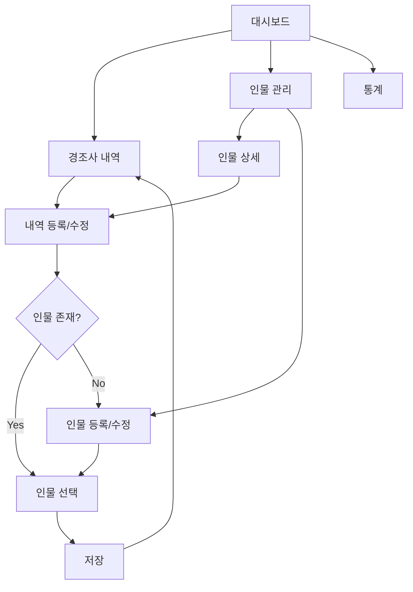

# 📝 요구사항 명세서 (SRS)
## 경조사비 관리 앱 - Software Requirements Specification

---

## 1. 기능 요구사항 목록

### 1.1 인물 관리

| ID | 요구사항 | 우선순위 | 비고 |
|----|----------|----------|------|
| FR-P01 | 인물을 등록할 수 있어야 한다 (이름, 관계, 전화번호, 메모) | 필수 | |
| FR-P02 | 인물 목록을 조회할 수 있어야 한다 | 필수 | 페이지네이션 |
| FR-P03 | 인물 정보를 수정할 수 있어야 한다 | 필수 | |
| FR-P04 | 인물을 삭제할 수 있어야 한다 | 필수 | 확인 모달 |
| FR-P05 | 인물 이름으로 검색할 수 있어야 한다 | 필수 | |
| FR-P06 | 관계 유형별로 인물을 필터링할 수 있어야 한다 | 보통 | |
| FR-P07 | 인물 상세 페이지에서 해당 인물과의 주고받은 내역을 볼 수 있어야 한다 | 필수 | |
| FR-P08 | 인물별 총 지출/수입/잔액을 표시해야 한다 | 필수 | |

### 1.2 경조사 내역 관리

| ID | 요구사항 | 우선순위 | 비고 |
|----|----------|----------|------|
| FR-E01 | 경조사비 지출(SENT) 내역을 등록할 수 있어야 한다 | 필수 | |
| FR-E02 | 경조사비 수입(RECEIVED) 내역을 등록할 수 있어야 한다 | 필수 | |
| FR-E03 | 대상 인물, 유형, 방향, 금액, 날짜, 메모를 입력할 수 있어야 한다 | 필수 | |
| FR-E04 | 내역 목록을 조회할 수 있어야 한다 | 필수 | 페이지네이션 |
| FR-E05 | 내역을 수정할 수 있어야 한다 | 필수 | |
| FR-E06 | 내역을 삭제할 수 있어야 한다 | 필수 | 확인 모달 |
| FR-E07 | 유형/방향/기간/금액 범위로 필터링 가능해야 한다 | 보통 | |
| FR-E08 | 금액 입력 시 빠른 선택 버튼을 제공해야 한다 (5만/10만/20만/30만) | 보통 | |
| FR-E09 | 금액 표시 시 원화 형식으로 보여야 한다 (예: ₩100,000) | 필수 | |

### 1.3 그룹 관리

| ID | 요구사항 | 우선순위 | 비고 |
|----|----------|----------|------|
| FR-G01 | 그룹을 생성할 수 있어야 한다 (예: 회사, 동창회) | 보통 | |
| FR-G02 | 인물을 그룹에 할당할 수 있어야 한다 | 보통 | 다중 그룹 |
| FR-G03 | 그룹별로 인물을 조회할 수 있어야 한다 | 보통 | |
| FR-G04 | 그룹을 수정/삭제할 수 있어야 한다 | 보통 | |

### 1.4 대시보드

| ID | 요구사항 | 우선순위 | 비고 |
|----|----------|----------|------|
| FR-D01 | 총 지출/수입/잔액 요약 카드를 표시해야 한다 | 필수 | |
| FR-D02 | 월별 지출/수입 추이 차트를 표시해야 한다 | 필수 | 바 차트 |
| FR-D03 | 최근 경조사 내역 5건을 표시해야 한다 | 필수 | |
| FR-D04 | 관계별 통계를 원형 차트로 표시해야 한다 | 보통 | |

### 1.5 통계

| ID | 요구사항 | 우선순위 | 비고 |
|----|----------|----------|------|
| FR-S01 | 연도별 월간 통계를 볼 수 있어야 한다 | 필수 | |
| FR-S02 | 경조사 유형별 평균/최소/최대 금액을 볼 수 있어야 한다 | 보통 | |
| FR-S03 | 관계별 통계 비교가 가능해야 한다 | 보통 | |
| FR-S04 | 경조사비 추천 금액을 제공해야 한다 (v2) | 낮음 | |

---

## 2. 비기능 요구사항

| ID | 요구사항 | 우선순위 | 기준값 |
|----|----------|----------|--------|
| NFR-01 | 페이지 로딩 3초 이내 | 필수 | LCP < 3s |
| NFR-02 | API 응답 500ms 이내 | 필수 | P95 |
| NFR-03 | 모바일 기기에서 사용 가능 | 필수 | 320px+ |
| NFR-04 | 데스크톱 기기에서 사용 가능 | 필수 | 1024px+ |
| NFR-05 | 데이터 영구 보존 (클라우드 DB) | 필수 | |
| NFR-06 | SQL Injection 방지 | 필수 | ORM |
| NFR-07 | XSS 방지 | 필수 | React 자동 |
| NFR-08 | HTTPS 통신 | 필수 | |

---

## 3. 비즈니스 규칙

| ID | 규칙 | 설명 |
|----|------|------|
| BR-01 | 금액은 양수여야 한다 | 0원 이하 불가 |
| BR-02 | 경조사 날짜는 미래 날짜 가능 | 예약 등록 허용 |
| BR-03 | 인물 삭제 시 관련 내역도 삭제 | CASCADE |
| BR-04 | 같은 인물에 중복 내역 허용 | 같은 날 동일 유형/금액 가능 |
| BR-05 | 잔액 = 수입 - 지출 | 양수: 내가 더 받음, 음수: 내가 더 줌 |
| BR-06 | 추천 금액 = 유형별 평균 + 관계별 평균 가중치 | v2 기능 |

---

## 4. 화면 흐름도

---

## 5. 유스케이스 시나리오

### UC-01: 경조사비 지출 기록
1. 사용자가 "내역 등록" 버튼 클릭
2. 방향 선택: "보낸 경조사비 (지출)"
3. 인물 검색/선택 (없으면 새 등록)
4. 경조사 유형 선택 (결혼, 장례 등)
5. 금액 입력 (빠른 선택 또는 직접 입력)
6. 날짜 선택
7. 메모 입력 (선택)
8. 저장 → 성공 토스트 → 목록 이동

### UC-02: 인물별 잔액 확인
1. 인물 관리 페이지 진입
2. 인물 이름 검색
3. 인물 카드에서 잔액 확인 (보낸/받은/차액)
4. 클릭하여 상세 페이지에서 모든 내역 확인
